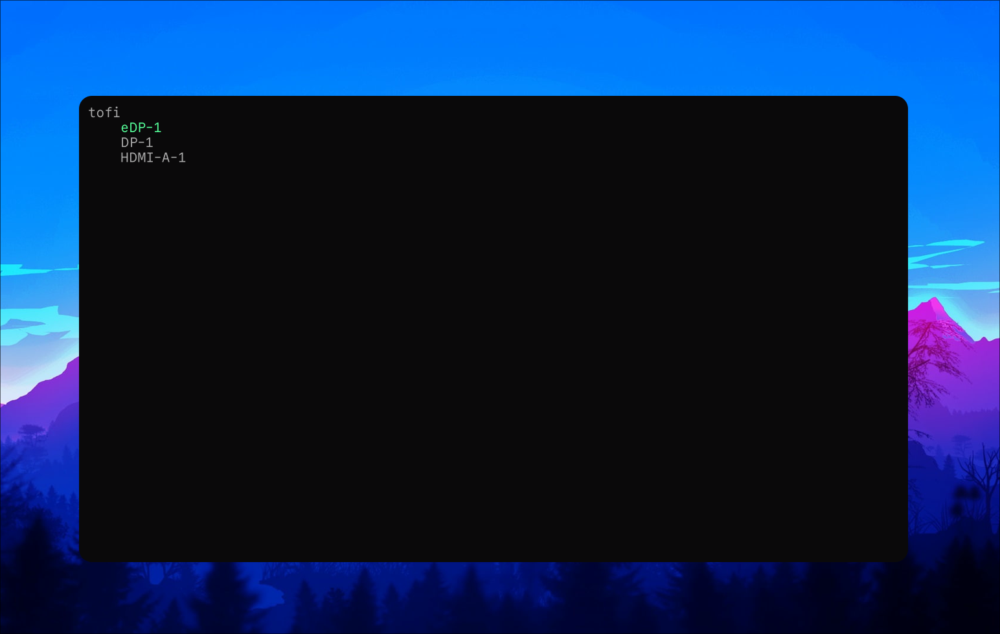
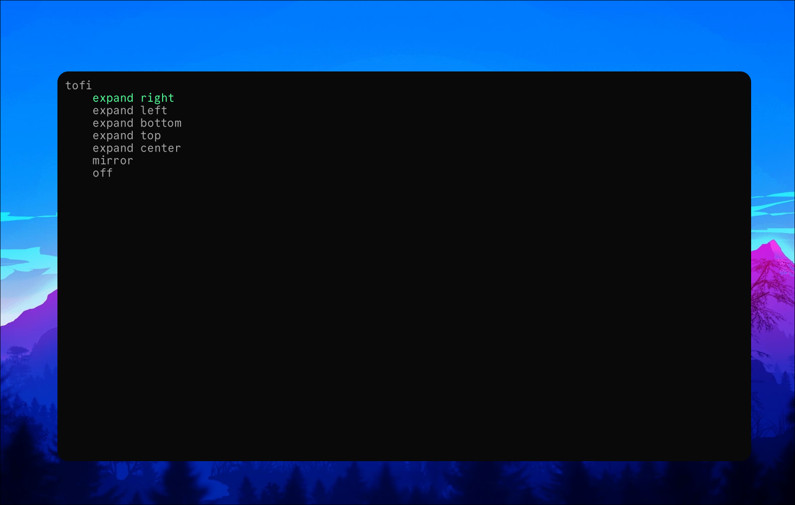

# Win + P for Hyprland

This is a short Python script to control your monitors.

## Installation
Download the python file and make it executable:
```sh
mkdir -p ~/.config/hypr/tools/ && curl -o ~/.config/hypr/tools/monitor.py https://raw.githubusercontent.com/MuedeHydra/Win-P-for-Hyprland/refs/heads/main/monitor.py
sudo chmod +x ~/.config/hypr/tools/monitor.py
```
Add a bind to your `hyprland.conf` file.

for example:
```
$mainMod = SUPER
bind = $mainMod, P, exec, ~/.config/hypr/tools/monitor.py
```
## App launcher
The default launcher for the script is `tofi`, if you are using wofi or another launcher you can change the following line:
```py
# wofi example
launcher: str = "wofi -i --dmenu"
```

## Screenshots



